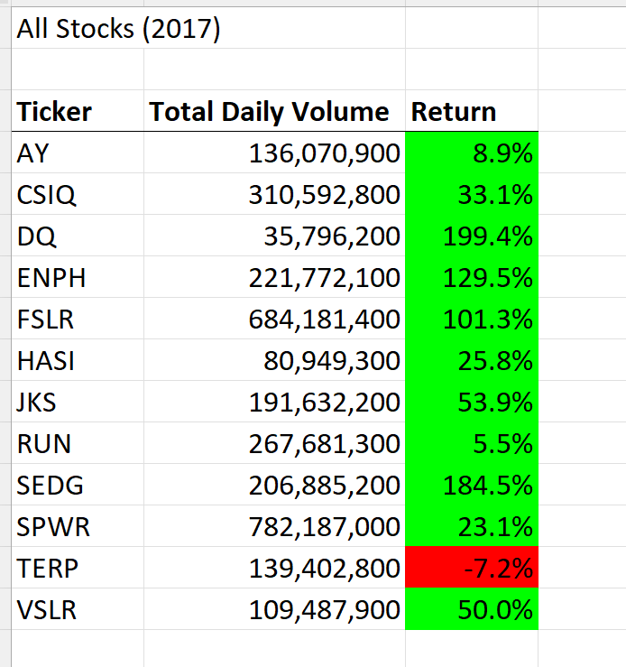
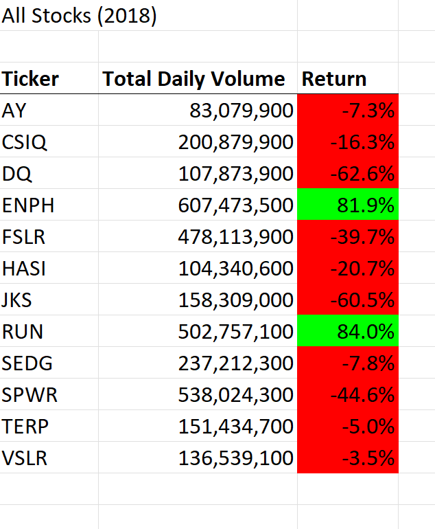
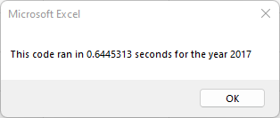
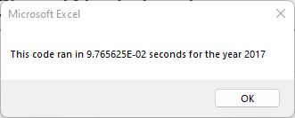
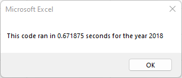
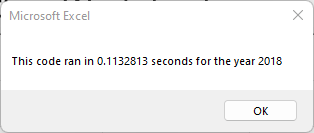

# VBA Refactored Procedure Performance

## Overview

The purpose of this project is to refactor the yearValueAnalysis() VBA procedure so that it runs using  more efficient algorithm that reads each row only once. Additionally, this analysis will compare stock returns for 2017 and 2018 as well as compare execution times of both the original and refactored VBA procedures.

## Results

### Stock Performance





As made clear by color formatting and percentages, the selected stocks performed fairly well in 2017 (the exception being TERP, down 7.2%). However, most stocks took a significant hit in 2018, the exceptions being ENPH (up 81.9%), RUN (up 84.0%), and VSLR (down only 3.5%). It looks like these stock picks might be high-risk investments because they had both high returns and high losses in the years 2017 and 2018.

### Code Performance






The refactored code was 5.93 times faster for 2018 and 6.6 times faster for 2017. As shown in the code listings appendix, the refactored code loops through each row in the datasheet only once, while the original code loops through the datasheet once for every ticker value.

## Summary

### Refactored Code in General

Generally speaking, refactored code has the advantage that it is often faster and more well-organized than code that has not been refactored. A main disadvantage, however, is that the original code might follow the programmer's thought process more closely and therefore might be easier to read, modify, and adapt to a new situation. The process of refactoring code might cause the reader to lose theoretical information about the problem that existed in the original code. Hence, a programmer must decide whether the improved performance of refactored code is worth any loss of information.

### The Refactored and Original Scripts

The code was refactored to loop over each row in the datasheet only once, which significantly improves the run time. However, the refactored code assumes that the data are grouped and sorted by ticker in ascending order. If new data is not grouped or sorted in this way, the original procedure will still work but the refactored procedure will not work. Remember to ensure that a datasheet is grouped and sorted by ticker in ascending order before using the refactored procedure.

## Appendix: Code Listings

```
Sub AllStocksAnalysisRefactored()
    Dim startTime As Single
    Dim endTime  As Single

    yearValue = InputBox("What year would you like to run the analysis on?")

    startTime = Timer
    
    'Format the output sheet on All Stocks Analysis worksheet
    Worksheets("Refactored Analysis").Activate
    
    Range("A1").Value = "All Stocks (" + yearValue + ")"
    
    'Create a header row
    Cells(3, 1).Value = "Ticker"
    Cells(3, 2).Value = "Total Daily Volume"
    Cells(3, 3).Value = "Return"

    'Initialize array of all tickers
    Dim tickers(12) As String
    
    tickers(0) = "AY"
    tickers(1) = "CSIQ"
    tickers(2) = "DQ"
    tickers(3) = "ENPH"
    tickers(4) = "FSLR"
    tickers(5) = "HASI"
    tickers(6) = "JKS"
    tickers(7) = "RUN"
    tickers(8) = "SEDG"
    tickers(9) = "SPWR"
    tickers(10) = "TERP"
    tickers(11) = "VSLR"
    
    'Activate data worksheet
    Worksheets(yearValue).Activate
    
    'Get the number of rows to loop over
    RowCount = Cells(Rows.Count, "A").End(xlUp).Row
    
    '1a) Create a ticker Index
    Dim tickerIndex As Integer
    tickerIndex = 0
    

    '1b) Create three output arrays   
    Dim tickerVolumes(12) As Long
    Dim tickerStartingPrices(12) As Single
    Dim tickerEndingPrices(12) As Single
    
    ''2a) Create a for loop to initialize the tickerVolumes to zero.

    For i = 0 To 11
        tickerVolumes(i) = 0.0
    Next i
    
        
    ''2b) Loop over all the rows in the spreadsheet. 
    For i = 2 To RowCount
    
        '3a) Increase volume for current ticker
        tickerVolumes(tickerIndex) = tickerVolumes(tickerIndex) + Cells(i, 8).Value
        
        
        '3b) Check if the current row is the first row with the selected tickerIndex.
        'If  Then

        If (Cells(i, 1).Value = tickers(tickerIndex)) And (Cells(i - 1, 1).Value <> tickers(tickerIndex)) Then
            tickerStartingPrices(tickerIndex) = Cells(i, 6).Value
        End If
            
            
            
        'End If
        
        '3c) check if the current row is the last row with the selected ticker
         'If the next row’s ticker doesn’t match, increase the tickerIndex.
        'If  Then
        If (Cells(i, 1).Value = tickers(tickerIndex)) And (Cells(i + 1, 1).Value <> tickers(tickerIndex)) Then
            
            'set ending price
            tickerEndingPrices(tickerIndex) = Cells(i, 6).Value
            '3d Increase the tickerIndex.
            tickerIndex = tickerIndex + 1
            
        End If
        'End If
    
    Next i
    
    '4) Loop through your arrays to output the Ticker, Total Daily Volume, and Return.
    For i = 0 To 11
        
        Worksheets("Refactored Analysis").Activate
        
        Cells(4 + i, 1).Value = tickers(i)
        Cells(4 + i, 2).Value = tickerVolumes(i)
        Cells(4 + i, 3).Value = tickerEndingPrices(i) / tickerStartingPrices(i) - 1
        
    Next i
    
    'Formatting
    Worksheets("Refactored Analysis").Activate
    Range("A3:C3").Font.FontStyle = "Bold"
    Range("A3:C3").Borders(xlEdgeBottom).LineStyle = xlContinuous
    Range("B4:B15").NumberFormat = "#,##0"
    Range("C4:C15").NumberFormat = "0.0%"
    Columns("B").AutoFit

    dataRowStart = 4
    dataRowEnd = 15

    For i = dataRowStart To dataRowEnd
        
        If Cells(i, 3) > 0 Then
            
            Cells(i, 3).Interior.Color = vbGreen
            
        Else
        
            Cells(i, 3).Interior.Color = vbRed
            
        End If
        
    Next i
 
    endTime = Timer
    MsgBox "This code ran in " & (endTime - startTime) & " seconds for the year " & (yearValue)

End Sub

Sub yearValueAnalysis()

    Dim startTime As Single
    Dim endTime As Single

    Dim yearValue As String
    yearValue = InputBox("What year would you like to run the analysis on?")
    startTime = Timer
 '1) Format the output sheet on All Stocks Analysis worksheet
   Worksheets("All Stocks Analysis").Activate
   Range("A1").Value = "All Stocks (" + yearValue + ")"
   'Create a header row
   Cells(3, 1).Value = "Ticker"
   Cells(3, 2).Value = "Total Daily Volume"
   Cells(3, 3).Value = "Return"

   '2) Initialize array of all tickers
   Dim tickers(11) As String
   tickers(0) = "AY"
   tickers(1) = "CSIQ"
   tickers(2) = "DQ"
   tickers(3) = "ENPH"
   tickers(4) = "FSLR"
   tickers(5) = "HASI"
   tickers(6) = "JKS"
   tickers(7) = "RUN"
   tickers(8) = "SEDG"
   tickers(9) = "SPWR"
   tickers(10) = "TERP"
   tickers(11) = "VSLR"
   '3a) Initialize variables for starting price and ending price
   Dim startingPrice As Single
   Dim endingPrice As Single
   '3b) Activate data worksheet
   Worksheets(yearValue).Activate
   '3c) Get the number of rows to loop over
   RowCount = Cells(Rows.Count, "A").End(xlUp).Row
   
   ' 4 loop through tickers
   For i = 0 To 11
    ticker = tickers(i)
    totalVolume = 0
    
    'loop through rows
    Worksheets(yearValue).Activate
    For j = 2 To RowCount
        ' 5a get total value of current ticker
        If Cells(j, 1).Value = ticker Then
            totalVolume = totalVolume + Cells(j, 8).Value
        End If
        
        ' 5b get starting price for current ticker
        If Cells(j - 1, 1).Value <> ticker And Cells(j, 1) = ticker Then
            startingPrice = Cells(j, 6).Value
        End If
        
        ' 5c get ending price for current ticker
        If Cells(j + 1, 1).Value <> ticker And Cells(j, 1) = ticker Then
            endingPrice = Cells(j, 6).Value
        End If
        
    Next j

' output data
Worksheets("All Stocks Analysis").Activate
Cells(4 + i, 1).Value = ticker
Cells(4 + i, 2).Value = totalVolume
Cells(4 + i, 3).Value = endingPrice / startingPrice - 1

   Next i
   
   
       'Formatting
    Worksheets("All Stocks Analysis").Activate
    Range("A3:C3").Font.FontStyle = "Bold"
    Range("A3:C3").Borders(xlEdgeBottom).LineStyle = xlContinuous
    Range("B4:B15").NumberFormat = "#,##0"
    Range("C4:C15").NumberFormat = "0.0%"
    Columns("B").AutoFit

    dataRowStart = 4
    dataRowEnd = 15

    For i = dataRowStart To dataRowEnd
        
        If Cells(i, 3) > 0 Then
            
            Cells(i, 3).Interior.Color = vbGreen
            
        Else
        
            Cells(i, 3).Interior.Color = vbRed
            
        End If
        
    Next i
 


    endTime = Timer
    MsgBox ("This code ran in " & (endTime - startTime) & " seconds for the year " & (yearValue))


End Sub

Sub ClearWorksheet()

    Cells.Clear

End Sub
```
